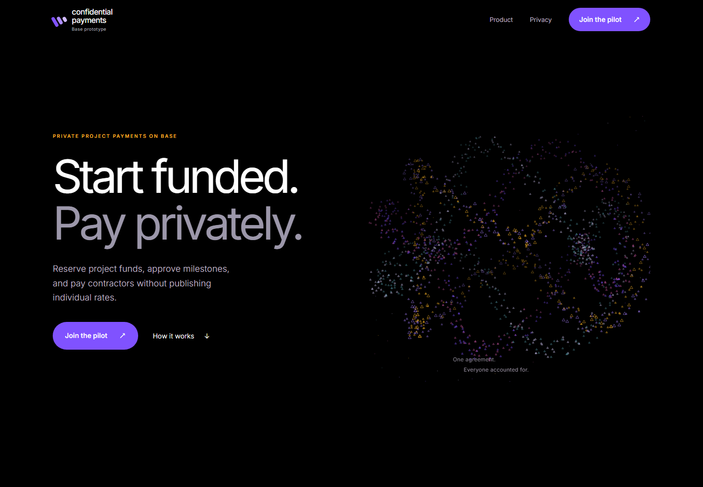

# Confidential Payments Prototype on Base

A concept website and a separate Solidity experiment for paying agency contractors without publishing individual allocations.

[Live concept site](https://base-confidential-payments-prototype.vercel.app) · [Engineering notes](docs/engineering.md) · [Contract experiment](contracts/README.md)



## Project status

| Part              | What you can use                                                                                                                                                                                          |
| ----------------- | --------------------------------------------------------------------------------------------------------------------------------------------------------------------------------------------------------- |
| Website           | Hosted design prototype with an interactive visibility explainer and a local text-file download. No accounts, wallet connection, or payment execution.                                                    |
| Escrow experiment | A local Foundry model of encrypted allocations, release accounting, and pre-release refunds. It is not deployed or audited for production.                                                                |
| Network           | Base is the intended settlement chain. The experiment restricts execution to Base Sepolia, chain ID `84532`.                                                                                              |
| Background        | Prepared alongside a Base Batches application draft. The application was not submitted. The `hackathon-projects/base` category is portfolio organization, not a claim of event participation or an award. |

**No customer funds are accepted.** The website does not call the contracts. The proposed backend, milestones, disputes, document storage, and recovery flows are not implemented.

## The engineering problem

A client, an agency, and its contractors need different views of the same payment agreement. The client needs to know whether work is funded; contractors need their own allocation without access to each other's rates.

This repository separates two questions: how to explain those boundaries in the browser, and how confidential transfers affect escrow accounting. In the local token model, a transfer can return zero without reverting. The escrow therefore tracks returned amounts rather than treating a successful call as proof of payment.

## Stack

| Area                | Implementation                                                             |
| ------------------- | -------------------------------------------------------------------------- |
| Website             | Next.js 16, React 19, TypeScript, native CSS, Canvas 2D, self-hosted Inter |
| Frontend checks     | Node test runner, Playwright desktop/mobile projects, axe-core             |
| Contract experiment | Solidity 0.8.30, Foundry 1.7.1, Inco Lightning 1.0.2                       |
| Network inspection  | viem; read-only Base Sepolia RPC calls                                     |
| Delivery            | Vercel, optional Docker Compose, GitHub Actions                            |

Exact JavaScript versions are pinned in [package.json](package.json), [pnpm-lock.yaml](pnpm-lock.yaml), and the separate [contract package](contracts/package.json). Go, PostgreSQL, and Clerk appear in design documents only; they are not part of the running application.

## Run locally

Use Node.js 24 and pnpm 12.3.4. The website needs no credentials or environment file.

```bash
git clone https://github.com/SourceSenseiTheRealOne/hackathon-projects-base-confidential-payments-prototype.git
cd hackathon-projects-base-confidential-payments-prototype
npm install --global pnpm@12.3.4
pnpm install --frozen-lockfile
pnpm dev
```

Open http://127.0.0.1:4180. For a production build, run `pnpm build` followed by `pnpm start`. Stop an existing native preview before rebuilding its `.next` output.

Docker is optional: `docker compose up -d --build` exposes http://127.0.0.1:4182. The container runs without root, with a read-only filesystem and dropped capabilities.

## Run the checks

```bash
pnpm test
pnpm typecheck
pnpm build
pnpm exec playwright install chromium
pnpm test:e2e
```

Playwright owns port `4181` and tests the production build. Its checks cover responsive layout, assets and browser errors, keyboard interaction, reduced motion, automated accessibility, and the download-only form's network behavior. `pnpm audit --prod` checks production dependencies separately.

For the isolated contracts:

```bash
cd contracts
npm ci --ignore-scripts
npm test
```

The pinned native Foundry binary is invoked through a wrapper that preserves its exit code. `npm run preflight` performs public network reads only; it neither deploys nor sends payments. See the [contract setup and limitations](contracts/README.md).

## Read the implementation

```text
app/          Pages, metadata, and styles
components/   Canvas, keyboard-accessible tabs, and brief-download form
lib/          Input validation and explanatory visibility policies
contracts/    Independent Solidity sources, test double, tests, and RPC probe
tests/        Unit, CI-policy, and browser checks
docs/         Engineering notes, research, and dated verification records
```

The [engineering notes](docs/engineering.md) explain the browser data flow, animation budget, contract decisions, and what the tests do not establish. The [Inco feasibility notes](docs/research/inco-feasibility.md) cover provider trust, disclosure, and deployment gaps.

Earlier documents use the names Scopeveil or Pactrail. Historical reports retain their original names, hashes, and deployment addresses; they are not verification of later revisions. Current repository identity and collection placement are recorded in [context/brand.md](context/brand.md).

## Use and limitations

This is a study artifact, not a payment service. Confidential amounts do not imply anonymous activity. The local test token is not the deployed cToken implementation, and its decryption helpers do not prove unauthorized-decryption resistance.

This repository has no repository-wide open-source license. Solidity files carry their own SPDX notices, and third-party dependencies retain their licenses. Inco's license and provider trust model require separate assessment before reuse in a commercial system.
